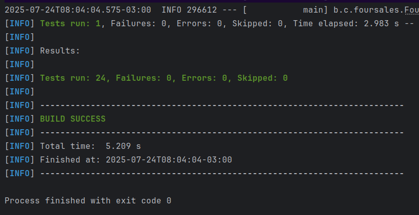

# Sistema de Gerenciamento de Produtos e Pedidos para E-commerce

Esta é uma API RESTful desenvolvida com Java 17 e Spring Boot para gerenciar produtos, usuários e pedidos em um sistema de e-commerce.

- A aplicação oferece funcionalidades como:

- Cadastro, atualização e consulta de produtos

- Registro e gerenciamento de usuários
- Consultas otimizadas e robusta no banco de dados para:
  - Criação e listagem de pedidos com seus respectivos produtos e usuários

  - Cálculo do ticket médio por usuário

  - Listagem dos usuários que mais compraram

- Cálculo do valor total faturado no mês

A arquitetura segue os princípios da arquitetura limpa, promovendo organização e desacoplamento entre camadas. A documentação da API é gerada automaticamente com Swagger/OpenAPI. A aplicação pode ser facilmente executada via Docker e Docker Compose.

Infelizmente não tive tanto tempo como queria para desenvolver de uma forma mais "polida", tive imprevistos e tive que fazer em dois dias, mas posso evoluir ela se quiserem.

## Tecnologias Utilizadas

- Java 17
- Spring Boot
- Spring Data JPA
- MySQL
- Maven
- Docker / Docker Compose
- Swagger (OpenAPI 3)
- MapStruct
- Lombok
- Junit
- Mockito

---

## Como Rodar o Projeto

### Pré-requisitos

- Docker e Docker Compose instalados
- Java 17 e Maven (apenas se quiser rodar localmente fora do Docker)

### Passos com Docker (recomendado)

1. Clone o repositório:
   ```bash
   git clone https://github.com/viniciuscavalheiro1/FourSales-E-commerce.git
   
   cd FourSales-E-commerce/foursales
   
   docker-compose up -d

### Importar Collection no Postman

O arquivo ```FourSales E-commerce API.postman_collection.json``` na raiz do projeto contem todas as collections para importar no postman. Basta importar e começar testar a API

### Ainda deu para fazer alguns testes com Junit e Mockito



